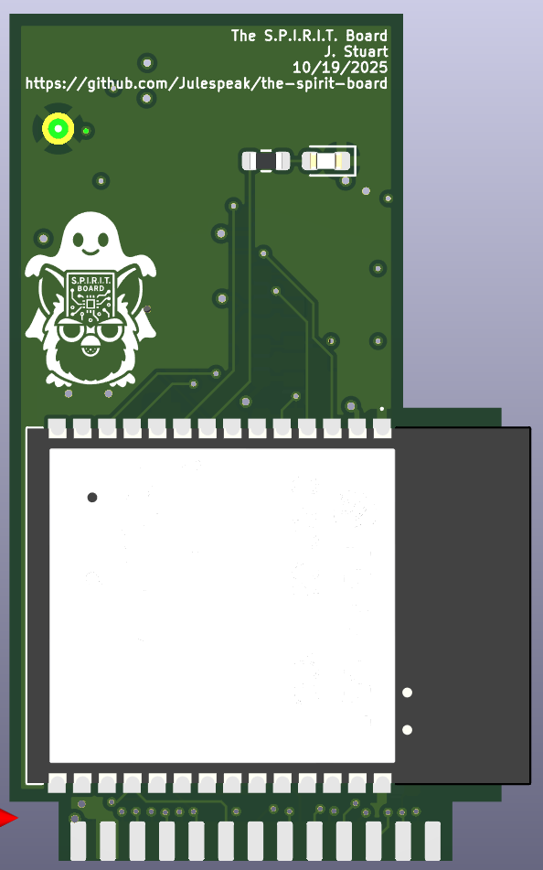
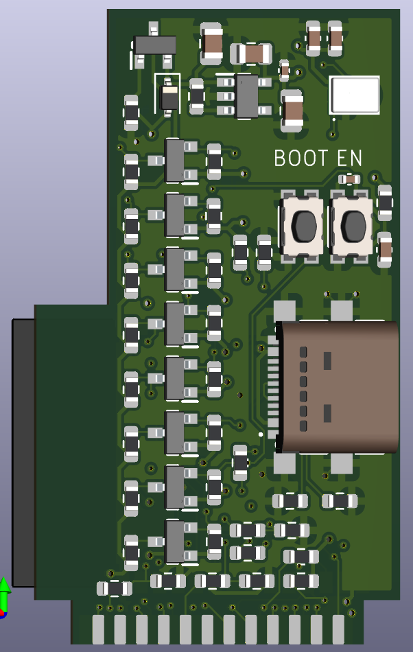

# The S.P.I.R.I.T. Board

An open-source Furby controller based on the ESP32-C6 module.

The goal of this project was to create a modern interface for the original 1998 Furby so that it could be reprogammed into a "haunted" version of the orignal toy. 👻

### Special Peripheral Interface for Receiving Internet Transmissions
The design of the board is based closely on the [Adafruit ESP32-C6 Feather](https://learn.adafruit.com/adafruit-esp32-c6-feather).

### Using the project
The project was designed using KiCAD. It is fully portable. You should be able to clone the repo and open the .pro file with the latest version of KiCAD.

The version of KiCAD used in the design was 9.0. If you use something else, YMMV.

### Data Analysis Environment

This project includes a Jupyter Lab environment for analyzing data from the Spirit Board (e.g., RTS timing data, signal analysis). The environment is managed using `uv`, a fast Python package manager.

**Prerequisites:**
- Python 3.10 or higher
- `uv` package manager - Install with: `curl -LsSf https://astral.sh/uv/install.sh | sh`

**Setup:**
1. Install dependencies and create virtual environment:
   ```bash
   uv sync
   ```

2. Launch Jupyter Lab:
   ```bash
   uv run jupyter lab
   ```

3. Open notebooks in the `notebooks/` directory

**Adding Dependencies:**
To add new packages for data analysis:
```bash
uv add pandas           # Data analysis
uv add scikit-learn     # Machine learning
uv add seaborn          # Statistical visualization
```

**Note:** Always commit both `pyproject.toml` and `uv.lock` to ensure reproducible environments across different machines.

### Adding new components to the library
1) Download the part footprint/3D model archive from Mouser
2) Copy the .kicad_mod file to the lib folder
3) Edit the .kicad_mod fle to include 'lib/the-spirit-board.3dshapes/' in the file name of the step file
4) Copy the step file into the 3D lib/<>.3dshapes folder
5) Insert the contents of the .kicad_sym file into the master .kicad_sym file
6) Save everything and commit

### Documentation

- **[Furby Soundcard Protocol Specification](docs/soundcard_spec.md)** - Complete technical specification of the Furby sound coprocessor communication protocol
- **[CLAUDE.md](CLAUDE.md)** - AI assistant context and project structure
- **[firmware/invoker/README.md](firmware/invoker/README.md)** - Firmware module documentation

### Useful links and sources
- [Technical information](https://official-furby.fandom.com/wiki/Furby_(1998)/Technical_information) on the original 1998 Furby from the offical fan wiki
- Reversed-engineered 1998 Furby [schematic](https://cdn.preterhuman.net/texts/engineering/Furby,%20Reverse-Engineered.pdf)
- I got inspiration for the I2S microphone peripheral from the [onju-voice](https://github.com/justLV/onju-voice) project
- This [Instructable](https://www.instructables.com/Control-a-Furby-with-Arduino-or-other-microcontrol/) on how to use an Arduino to control a Furby was quite useful, particularly with the labeled board photos
  - There are also lots of useful details on getting to the PCB in the previous [Instructable](https://www.instructables.com/Furby-Brain-Surgery/)
- The [original patent](https://patentimages.storage.googleapis.com/82/75/e2/13a4a9268abff4/US6544098.pdf) for the Furby is incredibly detailed—and fascinating!
- Useful [photo](https://sundbergferar.com/wp-content/uploads/2022/08/Furby.product.teardown.sundbergferar5.jpg) of the front side of the main PCB inside the Furby; the processor board that the S.P.I.R.I.T. board replaces is on the left side of the picture
- [Technical reference manual](https://www.espressif.com/sites/default/files/documentation/esp32-c6_technical_reference_manual_en.pdf) for the ESP32-C6
- [Datasheet](https://documentation.espressif.com/esp32-c6_datasheet_en.pdf) for the ESP32-C6
- [Schematic](https://cdn-learn.adafruit.com/assets/assets/000/131/884/original/adafruit_products_schem.png?1723750406) for the Adafruit ESP32-C6 Feather

### Board photos
#### Front

#### Back

